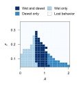

# Reproducibility
Science is in a [reproducibility crisis](https://molecularbrain.biomedcentral.com/articles/10.1186/s13041-020-0552-2). In the interest of open and reproducible research, we built this package with reproducibility as a core priority: key functions (simulation and optimization) are integrated into a command-line interface, hardcoding is minimized, and all analyses and visualization scripts include a clear entry point.

Below, we document the commands used for all model-related analyses in the paper:

<br>

### To run a grid search for finding a strong initial vector, x0:
```shell
python PescoidProject/pescoid_modelling/utils/grid_search.py \
    --config PescoidProject/configs/optimization_config.yaml \
    --max_tries 1000
```
This will output file `parameter_scan_log.csv` containing each simulation and an associated score.

<br>

### To run CMA-ES:
```shell
pescoid optimize \
    --config PescoidProject/configs/optimization_config.yaml \
    --optimization_target tissue_and_mesoderm
```

The grid-search derived x0 and bounds we utilized for our CMA-ES run are in [`optimization_config.yaml`](../configs/optimization_config.yaml). We ran our optimization for 48 hours on 36 cores via HPC. The optimization job utilized just under 20GB of memory.

<br>

### To plot optimization metrics:
```shell
python PescoidProject/pescoid_modelling/visualization/plot_optimization_metrics.py \
    --optim_csv /path/to/cma_restart.logxrecentbest.dat \
    --axlen_csv /path/to/cma_restart.logaxlen.dat \
    --stddev_csv /path/to/cma_restart.logstddev.dat \
    --fit_csv /path/to/cma_restart.logfit.dat
```
This will produce three figures:

`fit_sigma_axis.svg`
<div align="">
    
</div>
</br>

`axis_stddev_facet.svg`
<div align="">
    
</div>
</br>

`parameter_evolution.svg`
<div align="">
    
</div>
<br>

<br>

### To run the phase diagram sweep:
```shell
python PescoidProject/pescoid_modelling/analysis/phase_diagram_sweep.py \
    --sweep [AF or RTm]
```
This outputs file `phase_diagram_data.[SWEEP].csv` containing the sweep results.

<br>

### To plot the A x F vs wetting-dewetting sweep:
```shell
python PescoidProject/pescoid_modelling/visualization/plot_phase_diagram.py \
    --csv phase_diagram_data_af.csv \
    --sweep AF \
    --variable state
```
This will output:

`phase_diagram_AF.svg`.
<div align="">
    
</div>
<br>

<br>

### To plot the tau_m x R mesoderm onset sweep (fit with RSM):
```shell
python PescoidProject/pescoid_modelling/analysis/fit_rsm.py \
    --csv phase_diagram_data.rtm.csv
```
This will output:

`rsm.svg`.
<div align="">
    
</div>
<br>

<br>


### To produce the animations depicting simulation profiles:
```shell
python PescoidProject/pescoid_modelling/visualization/animate.py \
    --npz /path/to/simulation_results.npz
```
This will output animations depicting:
- [Wetting/dewetting and mesoderm values via radial symmetry](_static/pescoid_mesoderm_animation.gif)
- [Animations of density, velocity, mesoder, and stress](_static/pescoid_1d_profiles_animation.gif)
- Overlaid density, stress, and mesoderm during the simulation time

`pescoid_1d_overlay_animation.mp4`
<div align="">
    
</div>
<br>

<br>

### To plot spatial profiles (and more) from a simulation:
```shell
python PescoidProject/pescoid_modelling/visualization/plot_simulation_data.py \
    --npz /path/to/simulation_results.npz
```
This will output the following figures:
- [Tissue-size related metrics](_static/simulation_tissue_metrics.svg)
- [Mesoderm-related metrics](_static/simulation_mesoderm_metrics.svg)
- Each field's spatial profile

`simulation_spatial_fields.svg`
<div align="">
    
</div>
<br>
